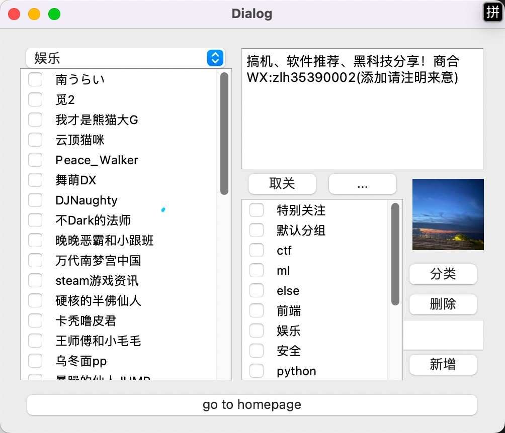
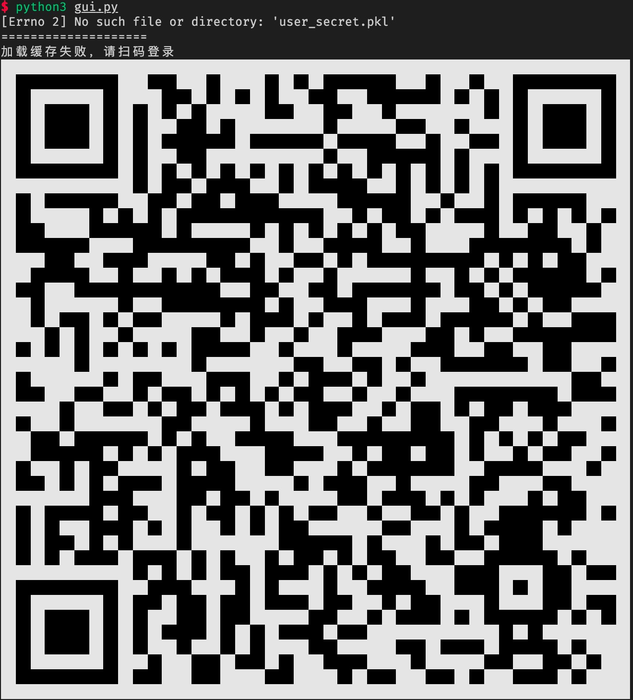

# bilibili up主 嵌套标签管理

> 目前还是非常早期的阶段，不过已经可以对up主进行多选分类了。

## 用之前把bili_user.py里面的uid换成你自己的

## Feature

- 支持创建分组

- 支持多选，并且进行分类

- 二维码登陆（不用去网站上面抓包）

- 优雅的代码结构

- 一键前往up主的主页（快速知道该up是干啥的）

- 加载签名和头像

> 已知的bug：
> 
> - 第二次创建新的分组的时候会闪退
> 
> - 短时间内取关非常多的人的时候会失败
> 
> TODO：
> 
> - 把头像加载改成异步的，要不然有点卡
> 
> - 修bug
> 
> - 上线网页版（vite+vue3 or quasar）

## 效果图

